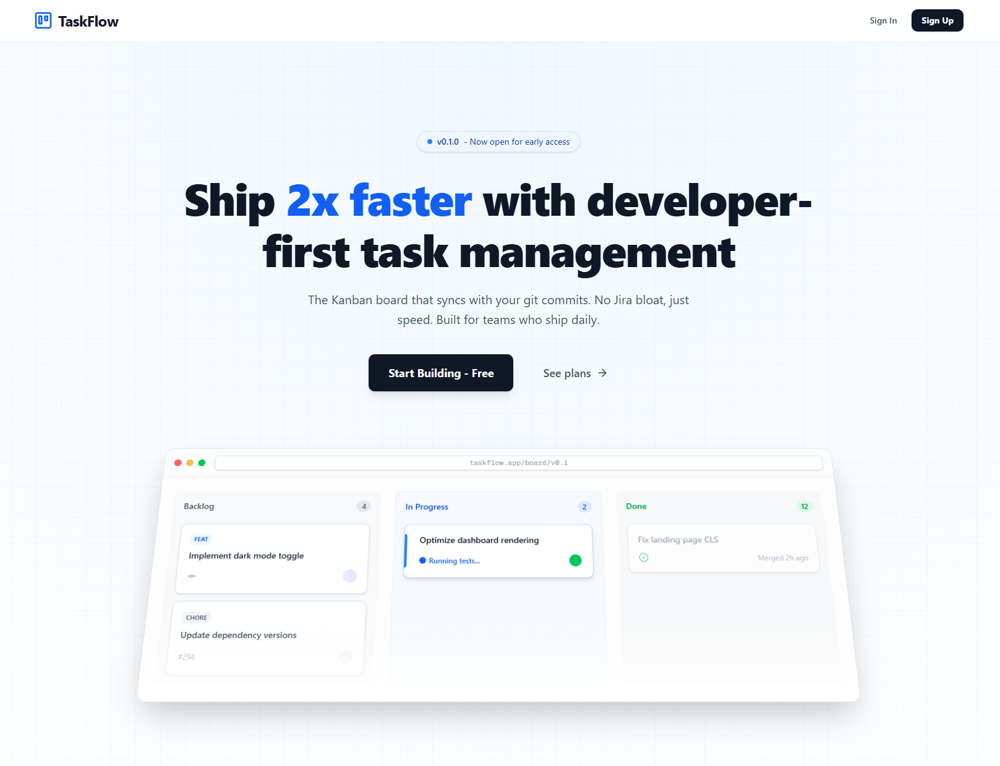

# TaskFlow Board - Task Management Board

A modern, full-featured project management application built with Next.js, featuring a beautiful UI, real-time updates, and powerful task management capabilities. Create boards, organize tasks with drag-and-drop, collaborate with your team, and track progress—all in a sleek, responsive interface.


## Table of Contents

- [Project Overview](#project-overview)
- [Features](#features)
- [Project Structure](#project-structure)
- [Installation](#installation)
- [Usage](#usage)
- [Dependencies](#dependencies)
- [Environment Variables](#environment-variables)
- [Contributing](#contributing)

## Project Overview

**TaskFlow Board** is a comprehensive project management application that delivers powerful project management capabilities with modern enhancements. Built with the latest web technologies, this application provides an intuitive interface for organizing tasks, managing boards, and tracking project progress.

### Key Capabilities

- **Board Management**: Create unlimited boards with custom colors and descriptions
- **Task Organization**: Organize tasks across customizable columns (To Do, In Progress, Review, Done)
- **Drag & Drop**: Seamless task reordering and movement between columns
- **Task Details**: Add descriptions, assignees, due dates, and priority levels
- **User Authentication**: Secure authentication powered by Clerk
- **Real-time Updates**: Backend powered by Supabase for instant synchronization
- **Responsive Design**: Beautiful UI that works on desktop, tablet, and mobile
- **Dashboard Analytics**: Track your boards and tasks at a glance

## Screenshots


_Modern landing page featuring a clean design with feature showcase and call-to-action_

## Features

### Core Features

- **User Authentication**

  - Sign up / Sign in with Clerk
  - Protected routes and user sessions
  - User profile management

- **Board Management**

  - Create, view, and edit boards
  - Custom board colors
  - Board descriptions
  - Archive/delete boards

- **Column Organization**

  - Default columns: To Do, In Progress, Review, Done
  - Create custom columns
  - Edit column titles
  - Reorder columns

- **Task Management**

  - Create tasks with rich details
  - Add descriptions, assignees, and due dates
  - Set priority levels (Low, Medium, High)
  - Drag and drop tasks within and across columns
  - Edit and delete tasks

- **Dashboard**

  - Overview of all boards
  - Task count per board
  - Quick board access
  - Board filtering and search

- **Modern UI/UX**
  - Clean, intuitive interface
  - Smooth animations and transitions
  - Color-coded priority indicators
  - Responsive design for all devices

## Project Structure

```
taskflow-board/
├── my-app/                          # Next.js application root
│   ├── app/                         # App router directory
│   │   ├── boards/                  # Board-related pages
│   │   │   └── [id]/               # Dynamic board page
│   │   │       └── page.tsx        # Board view with drag-and-drop
│   │   ├── dashboard/              # Dashboard pages
│   │   │   ├── layout.tsx          # Dashboard layout
│   │   │   └── page.tsx            # Dashboard view with boards
│   │   ├── pricing/                # Pricing page
│   │   │   └── page.tsx            # Pricing plans
│   │   ├── layout.tsx              # Root layout with Clerk
│   │   ├── page.tsx                # Landing page
│   │   └── globals.css             # Global styles
│   │
│   ├── components/                  # React components
│   │   ├── board/                  # Board-related components
│   │   │   ├── DroppableColumn.tsx # Droppable column with task list
│   │   │   ├── SortableTask.tsx    # Draggable task card
│   │   │   ├── TaskOverlay.tsx     # Drag overlay preview
│   │   │   └── index.ts            # Barrel exports
│   │   ├── ui/                     # shadcn/ui components
│   │   │   ├── button.tsx          # Button component
│   │   │   ├── card.tsx            # Card component
│   │   │   ├── dialog.tsx          # Modal dialog
│   │   │   ├── input.tsx           # Input field
│   │   │   ├── label.tsx           # Label component
│   │   │   ├── select.tsx          # Select dropdown
│   │   │   ├── textarea.tsx        # Textarea component
│   │   │   └── badge.tsx           # Badge component
│   │   ├── BoardCard.tsx           # Board card for dashboard
│   │   └── navbar.tsx              # Navigation bar
│   │
│   ├── lib/                        # Library and utilities
│   │   ├── contexts/               # React contexts
│   │   │   └── PlanContext.tsx     # Plan/subscription context
│   │   ├── hooks/                  # Custom React hooks
│   │   │   └── useBoards.ts        # Board management hook
│   │   ├── supabase/               # Supabase configuration
│   │   │   ├── client.ts           # Supabase client
│   │   │   ├── models.ts           # TypeScript models
│   │   │   └── SupabaseProvider.tsx # Supabase provider
│   │   ├── services.ts             # API services
│   │   └── utils.ts                # Utility functions
│   │
│   ├── public/                     # Static assets
│   │   └── *.svg                   # SVG icons and images
│   │
│   ├── .env                        # Environment variables (not in git)
│   ├── .gitignore                  # Git ignore file
│   ├── components.json             # shadcn/ui configuration
│   ├── eslint.config.mjs           # ESLint configuration
│   ├── next.config.ts              # Next.js configuration
│   ├── package.json                # Dependencies and scripts
│   ├── postcss.config.mjs          # PostCSS configuration
│   ├── proxy.ts                    # Proxy configuration
│   └── tsconfig.json               # TypeScript configuration
│
└── README.md                       # This file
```

### Key Files and Their Purpose

| File                       | Purpose                                            |
| -------------------------- | -------------------------------------------------- |
| `app/page.tsx`             | Landing page with features showcase and CTA        |
| `app/dashboard/page.tsx`   | Dashboard showing all boards with task counts      |
| `app/boards/[id]/page.tsx` | Main board view with drag-and-drop functionality   |
| `lib/services.ts`          | Service layer for API calls to Supabase            |
| `lib/supabase/models.ts`   | TypeScript interfaces for Board, Column, and Task  |
| `lib/hooks/useBoards.ts`   | Custom hook for board operations                   |
| `lib/utils.ts`             | Shared utilities (cn, getPriorityColor, etc.)      |
| `components/board/*`       | Extracted board components (Column, Task, Overlay) |
| `components/navbar.tsx`    | Navigation component with authentication           |
| `components/ui/*`          | Reusable UI components from shadcn/ui              |

## Installation

### Prerequisites

Before you begin, ensure you have the following installed:

- **Node.js** (v18 or higher)
- **npm** or **yarn** or **pnpm**
- A **Supabase** account ([https://supabase.com](https://supabase.com))
- A **Clerk** account ([https://clerk.com](https://clerk.com))

### Step-by-Step Setup

1. **Clone the repository**

```bash
git clone https://github.com/Lime-oss-hash/taskflow-board.git
cd taskflow-board/my-app
```

2. **Install dependencies**

```bash
npm install
# or
yarn install
# or
pnpm install
```

3. **Set up environment variables**

Create a `.env` file in the `my-app` directory with the following variables:

```env
# Supabase Configuration
NEXT_PUBLIC_SUPABASE_URL=your_supabase_project_url
NEXT_PUBLIC_SUPABASE_ANON_KEY=your_supabase_anon_key

# Clerk Configuration
NEXT_PUBLIC_CLERK_PUBLISHABLE_KEY=your_clerk_publishable_key
CLERK_SECRET_KEY=your_clerk_secret_key
NEXT_PUBLIC_CLERK_SIGN_IN_URL=/sign-in
NEXT_PUBLIC_CLERK_SIGN_UP_URL=/sign-up
```

4. **Set up Supabase database**

In your Supabase project, create the following tables:

**Boards Table:**

```sql
CREATE TABLE boards (
  id UUID DEFAULT gen_random_uuid() PRIMARY KEY,
  title TEXT NOT NULL,
  description TEXT,
  color TEXT NOT NULL DEFAULT 'bg-blue-500',
  user_id TEXT NOT NULL,
  created_at TIMESTAMP WITH TIME ZONE DEFAULT NOW(),
  updated_at TIMESTAMP WITH TIME ZONE DEFAULT NOW()
);
```

**Columns Table:**

```sql
CREATE TABLE columns (
  id UUID DEFAULT gen_random_uuid() PRIMARY KEY,
  board_id UUID NOT NULL REFERENCES boards(id) ON DELETE CASCADE,
  title TEXT NOT NULL,
  sort_order INTEGER NOT NULL,
  user_id TEXT NOT NULL,
  created_at TIMESTAMP WITH TIME ZONE DEFAULT NOW()
);
```

**Tasks Table:**

```sql
CREATE TABLE tasks (
  id UUID DEFAULT gen_random_uuid() PRIMARY KEY,
  column_id UUID NOT NULL REFERENCES columns(id) ON DELETE CASCADE,
  title TEXT NOT NULL,
  description TEXT,
  assignee TEXT,
  due_date TIMESTAMP WITH TIME ZONE,
  priority TEXT NOT NULL DEFAULT 'medium',
  sort_order INTEGER NOT NULL,
  created_at TIMESTAMP WITH TIME ZONE DEFAULT NOW(),
  updated_at TIMESTAMP WITH TIME ZONE DEFAULT NOW()
);
```

**Row Level Security (RLS) Policies:**

After creating the tables, set up RLS policies to ensure users can only access their own data:

```sql
-- Helper function to get the current user ID from JWT claims
CREATE OR REPLACE FUNCTION requesting_user_id()
RETURNS TEXT AS $$
  SELECT NULLIF(
    current_setting('request.jwt.claims', true)::json->>'sub',
    ''
  )::text;
$$ LANGUAGE SQL STABLE;

-- Enable RLS on all tables
ALTER TABLE boards ENABLE ROW LEVEL SECURITY;
ALTER TABLE columns ENABLE ROW LEVEL SECURITY;
ALTER TABLE tasks ENABLE ROW LEVEL SECURITY;

-- Boards RLS Policies
CREATE POLICY "Users can view their own boards"
  ON boards FOR SELECT
  USING (requesting_user_id() = user_id);

CREATE POLICY "Users can insert their own boards"
  ON boards FOR INSERT
  WITH CHECK (requesting_user_id() = user_id);

CREATE POLICY "Users can update their own boards"
  ON boards FOR UPDATE
  USING (requesting_user_id() = user_id);

CREATE POLICY "Users can delete their own boards"
  ON boards FOR DELETE
  USING (requesting_user_id() = user_id);

-- Columns RLS Policies
CREATE POLICY "Users can view columns from their own boards"
  ON columns FOR SELECT
  USING (
    EXISTS (
      SELECT 1 FROM boards
      WHERE boards.id = columns.board_id
      AND boards.user_id = requesting_user_id()
    )
  );

CREATE POLICY "Users can insert columns into their own boards"
  ON columns FOR INSERT
  WITH CHECK (
    EXISTS (
      SELECT 1 FROM boards
      WHERE boards.id = columns.board_id
      AND boards.user_id = requesting_user_id()
    )
  );

CREATE POLICY "Users can update columns in their own boards"
  ON columns FOR UPDATE
  USING (
    EXISTS (
      SELECT 1 FROM boards
      WHERE boards.id = columns.board_id
      AND boards.user_id = requesting_user_id()
    )
  );

CREATE POLICY "Users can delete columns from their own boards"
  ON columns FOR DELETE
  USING (
    EXISTS (
      SELECT 1 FROM boards
      WHERE boards.id = columns.board_id
      AND boards.user_id = requesting_user_id()
    )
  );

-- Tasks RLS Policies
CREATE POLICY "Users can view tasks from their own boards"
  ON tasks FOR SELECT
  USING (
    EXISTS (
      SELECT 1 FROM columns
      JOIN boards ON boards.id = columns.board_id
      WHERE columns.id = tasks.column_id
      AND boards.user_id = requesting_user_id()
    )
  );

CREATE POLICY "Users can insert tasks in their own boards"
  ON tasks FOR INSERT
  WITH CHECK (
    EXISTS (
      SELECT 1 FROM columns
      JOIN boards ON boards.id = columns.board_id
      WHERE columns.id = tasks.column_id
      AND boards.user_id = requesting_user_id()
    )
  );

CREATE POLICY "Users can update tasks in their own boards"
  ON tasks FOR UPDATE
  USING (
    EXISTS (
      SELECT 1 FROM columns
      JOIN boards ON boards.id = columns.board_id
      WHERE columns.id = tasks.column_id
      AND boards.user_id = requesting_user_id()
    )
  );

CREATE POLICY "Users can delete tasks from their own boards"
  ON tasks FOR DELETE
  USING (
    EXISTS (
      SELECT 1 FROM columns
      JOIN boards ON boards.id = columns.board_id
      WHERE columns.id = tasks.column_id
      AND boards.user_id = requesting_user_id()
    )
  );
```

5. **Run the development server**

```bash
npm run dev
# or
yarn dev
# or
pnpm dev
```

6. **Open your browser**

Navigate to [http://localhost:3000](http://localhost:3000) to see the application.

## Usage

### Getting Started

1. **Sign Up / Sign In**

   - Click "Get Started" on the landing page
   - Create an account or sign in with Clerk

2. **Navigate to Dashboard**

   - After signing in, you'll be redirected to your dashboard
   - View all your boards and their task counts

3. **Create Your First Board**

   - Click the "Create Board" button
   - Enter a title, description (optional), and choose a color
   - The board will be created with default columns

4. **Manage Tasks**

   - Click on a board to open the board view
   - Create tasks by clicking "Add Task" in any column
   - Fill in task details: title, description, assignee, due date, priority
   - Drag and drop tasks to reorder or move between columns

5. **Filter and Search**
   - Use the filter options to view tasks by priority, assignee, or due date
   - Search for specific boards or tasks

### Key Workflows

**Creating a New Board:**

```
Dashboard → Create Board → Enter Details → Submit → Board Created with Default Columns
```

**Adding a Task:**

```
Board View → Select Column → Add Task → Fill Details → Create Task
```

**Moving Tasks:**

```
Drag Task → Hover Over Target Column → Drop → Task Moved and Reordered
```

**Editing Board Settings:**

```
Board View → Edit Board Icon → Update Details → Save Changes
```

### Available Scripts

| Script          | Description                           |
| --------------- | ------------------------------------- |
| `npm run dev`   | Start development server on port 3000 |
| `npm run build` | Build production-ready application    |
| `npm run start` | Start production server               |
| `npm run lint`  | Run ESLint to check code quality      |

## Testing

This project includes comprehensive test coverage using **Vitest** for unit/component tests and **Playwright** for E2E browser testing.

| Command                 | Description                               |
| ----------------------- | ----------------------------------------- |
| `npm run test`          | Run unit tests with Vitest                |
| `npm run test:e2e`      | Execute E2E browser tests with Playwright |
| `npm run test:coverage` | Generate test coverage report             |
| `npm run test:watch`    | Run tests in watch mode                   |

## Dependencies

### Core Dependencies

| Package        | Version | Purpose                        |
| -------------- | ------- | ------------------------------ |
| **next**       | 16.0.1  | React framework for production |
| **react**      | 19.2.0  | UI library                     |
| **react-dom**  | 19.2.0  | React rendering for web        |
| **typescript** | ^5      | Type-safe JavaScript           |

### Authentication & Database

| Package                   | Version | Purpose                                |
| ------------------------- | ------- | -------------------------------------- |
| **@clerk/nextjs**         | ^6.34.5 | User authentication and management     |
| **@supabase/supabase-js** | ^2.80.0 | Supabase JavaScript client             |
| **@supabase/ssr**         | ^0.7.0  | Supabase Server-Side Rendering support |

### UI Components & Styling

| Package                      | Version  | Purpose                         |
| ---------------------------- | -------- | ------------------------------- |
| **@radix-ui/react-dialog**   | ^1.1.15  | Accessible modal dialogs        |
| **@radix-ui/react-label**    | ^2.1.8   | Form labels                     |
| **@radix-ui/react-select**   | ^2.2.6   | Dropdown selects                |
| **@radix-ui/react-slot**     | ^1.2.4   | Component composition           |
| **lucide-react**             | ^0.553.0 | Icon library                    |
| **tailwindcss**              | ^4       | Utility-first CSS framework     |
| **class-variance-authority** | ^0.7.1   | Variant-based className builder |
| **clsx**                     | ^2.1.1   | Conditional className utility   |
| **tailwind-merge**           | ^3.4.0   | Merge Tailwind classes          |

### Drag & Drop

| Package                | Version | Purpose                          |
| ---------------------- | ------- | -------------------------------- |
| **@dnd-kit/core**      | ^6.3.1  | Core drag-and-drop functionality |
| **@dnd-kit/sortable**  | ^10.0.0 | Sortable drag-and-drop           |
| **@dnd-kit/utilities** | ^3.2.2  | DnD Kit utilities                |

### Development Dependencies

| Package                  | Version | Purpose                      |
| ------------------------ | ------- | ---------------------------- |
| **@types/node**          | ^20     | Node.js type definitions     |
| **@types/react**         | ^19     | React type definitions       |
| **@types/react-dom**     | ^19     | React DOM type definitions   |
| **eslint**               | ^9      | Code linting                 |
| **eslint-config-next**   | 16.0.1  | Next.js ESLint configuration |
| **@tailwindcss/postcss** | ^4      | PostCSS for Tailwind         |
| **tw-animate-css**       | ^1.4.0  | Tailwind animation utilities |

## Environment Variables

The application requires the following environment variables to be configured in your `.env` file:

### Supabase Configuration

```env
NEXT_PUBLIC_SUPABASE_URL=https://your-project.supabase.co
NEXT_PUBLIC_SUPABASE_ANON_KEY=your-anon-key-here
```

- **NEXT_PUBLIC_SUPABASE_URL**: Your Supabase project URL (found in Project Settings → API)
- **NEXT_PUBLIC_SUPABASE_ANON_KEY**: Your Supabase anonymous/public key (found in Project Settings → API)

### Clerk Configuration

```env
NEXT_PUBLIC_CLERK_PUBLISHABLE_KEY=pk_test_...
CLERK_SECRET_KEY=sk_test_...
NEXT_PUBLIC_CLERK_SIGN_IN_URL=/sign-in
NEXT_PUBLIC_CLERK_SIGN_UP_URL=/sign-up
```

- **NEXT_PUBLIC_CLERK_PUBLISHABLE_KEY**: Clerk publishable key (found in Clerk Dashboard → API Keys)
- **CLERK_SECRET_KEY**: Clerk secret key (found in Clerk Dashboard → API Keys)
- **NEXT_PUBLIC_CLERK_SIGN_IN_URL**: Sign-in page route
- **NEXT_PUBLIC_CLERK_SIGN_UP_URL**: Sign-up page route

> **Note:** Never commit the `.env` file to version control. It's already included in `.gitignore`.

## Contributing

Contributions are welcome! Here's how you can help improve this project:

### How to Contribute

1. **Fork the repository**

   ```bash
   # Click the "Fork" button on GitHub
   ```

2. **Clone your fork**

   ```bash
   git clone https://github.com/Lime-oss-hash/my-own-trello.git
   cd my-own-trello/my-app
   ```

3. **Create a feature branch**

   ```bash
   git checkout -b feature/amazing-feature
   ```

4. **Make your changes**

   - Write clean, readable code
   - Follow the existing code style
   - Add comments where necessary
   - Test your changes thoroughly

5. **Commit your changes**

   ```bash
   git add .
   git commit -m "Add amazing feature"
   ```

6. **Push to your fork**

   ```bash
   git push origin feature/amazing-feature
   ```

7. **Open a Pull Request**
   - Go to the original repository
   - Click "New Pull Request"
   - Describe your changes in detail
   - Link any related issues

### Development Guidelines

- **Code Style**: Follow the existing ESLint configuration
- **TypeScript**: Ensure all code is properly typed
- **Comments**: Add detailed comments to complex logic
- **Testing**: Test all new features before submitting
- **Commits**: Write clear, descriptive commit messages
- **Documentation**: Update README.md if you add new features

### Ideas for Contributions

- UI/UX improvements
- Bug fixes
- New features (labels, attachments, comments)
- Documentation improvements
- Test coverage
- Accessibility enhancements
- Internationalization (i18n)
- Mobile app version

### Reporting Issues

If you find a bug or have a feature request:

1. Check if the issue already exists
2. Create a new issue with a descriptive title
3. Provide detailed information:
   - Steps to reproduce (for bugs)
   - Expected behavior
   - Actual behavior
   - Screenshots (if applicable)
   - Environment details (OS, browser, Node version)

## Acknowledgments

- **[PedroTech](https://www.youtube.com/@PedroTechnologies)** - Initial project inspiration and learning resource ([Build a Fullstack Trello App](https://www.youtube.com/watch?v=ugxI1o5SyMs&t=24081s))
- **Next.js** - The React framework for production
- **Clerk** - Authentication and user management
- **Supabase** - Backend-as-a-Service and database
- **shadcn/ui** - Beautiful and accessible UI components
- **dnd-kit** - Modern drag-and-drop toolkit
- **Radix UI** - Unstyled, accessible UI primitives
- **Tailwind CSS** - Utility-first CSS framework
- **Lucide** - Beautiful icon library

---

## Troubleshooting

### Common Issues and Solutions

#### Clerk Authentication Issues

**Problem: "Clerk is not defined" or authentication not working**

Solution:

```bash
# Verify Clerk environment variables are set correctly
# Check .env file has:
NEXT_PUBLIC_CLERK_PUBLISHABLE_KEY=pk_test_...
CLERK_SECRET_KEY=sk_test_...
NEXT_PUBLIC_CLERK_SIGN_IN_URL=/sign-in
NEXT_PUBLIC_CLERK_SIGN_UP_URL=/sign-up
```

After updating `.env`, restart the dev server:

```bash
# Stop the server (Ctrl+C) and restart
npm run dev
```

**Problem: Redirect loops after sign-in**

Solution: Check that your Clerk dashboard has the correct URLs configured:

- Go to Clerk Dashboard → Configure → Paths
- Set Sign-in path to `/sign-in`
- Set Sign-up path to `/sign-up`
- Set After sign-in URL to `/dashboard`
- Set After sign-up URL to `/dashboard`

**Problem: Webhook errors or user sync issues**

Solution:

```bash
# Ensure your Clerk webhook is configured correctly
# 1. Go to Clerk Dashboard → Webhooks
# 2. Add endpoint: https://your-domain.com/api/webhooks/clerk
# 3. Subscribe to events: user.created, user.updated, user.deleted
# 4. Copy signing secret and add to .env:
CLERK_WEBHOOK_SECRET=whsec_...
```

---

#### Supabase Connection Issues

**Problem: "Failed to fetch" or connection errors**

Solution:

```bash
# 1. Verify Supabase credentials in .env
NEXT_PUBLIC_SUPABASE_URL=https://xxxxx.supabase.co
NEXT_PUBLIC_SUPABASE_ANON_KEY=eyJhbGc...

# 2. Check Supabase project status at https://supabase.com/dashboard
# 3. Ensure your project is not paused (free tier pauses after inactivity)
# 4. Restart dev server after updating .env
```

**Problem: "relation does not exist" errors**

Solution: Your database tables haven't been created. Run the SQL scripts:

1. Go to Supabase Dashboard → SQL Editor
2. Copy and paste the table creation SQL from the [Installation](#-installation) section
3. Run the boards, columns, and tasks table creation scripts
4. Run the RLS policies setup

**Problem: CORS errors when making requests**

Solution:

```bash
# Ensure you're using the correct Supabase client initialization
# Check lib/supabase/client.ts matches:
import { createClient } from '@supabase/supabase-js'

export const supabase = createClient(
  process.env.NEXT_PUBLIC_SUPABASE_URL!,
  process.env.NEXT_PUBLIC_SUPABASE_ANON_KEY!
)
```

---

#### Row Level Security (RLS) Policy Errors

**Problem: "permission denied" or unable to fetch data**

Solution: RLS policies may not be set up correctly.

1. **First, verify the helper function exists:**

```sql
-- Run in Supabase SQL Editor
SELECT requesting_user_id();
-- Should return your user ID or NULL
```

2. **If function doesn't exist, create it:**

```sql
CREATE OR REPLACE FUNCTION requesting_user_id()
RETURNS TEXT AS $$
  SELECT NULLIF(
    current_setting('request.jwt.claims', true)::json->>'sub',
    ''
  )::text;
$$ LANGUAGE SQL STABLE;
```

3. **Check if RLS is enabled:**

```sql
-- Check RLS status
SELECT tablename, rowsecurity
FROM pg_tables
WHERE schemaname = 'public'
AND tablename IN ('boards', 'columns', 'tasks');
```

4. **View existing policies:**

```sql
SELECT schemaname, tablename, policyname
FROM pg_policies
WHERE schemaname = 'public';
```

5. **If policies are missing, run the complete RLS setup from the [Installation](#-installation) section**

**Problem: Can create boards but can't see them**

Solution: The `user_id` field might not match your Clerk user ID.

```sql
-- Check what user_id is being stored
SELECT id, title, user_id FROM boards LIMIT 5;

-- Your user_id should match your Clerk user ID (starts with 'user_')
-- If not, check your board creation code to ensure user_id is set correctly
```

**Problem: RLS policies work in SQL editor but not in the app**

Solution: The JWT claims might not be passed correctly.

```bash
# Ensure Supabase client is initialized with auth
# In your API calls, make sure the user's session is active
# Check that Clerk is properly integrated with Supabase
```

Verify the user session:

```typescript
// In your component
const { user } = useUser();
console.log("User ID:", user?.id); // Should match database user_id
```

---

#### Drag and Drop Not Working

**Problem: Tasks won't drag or drop**

Solution:

1. Check that `@dnd-kit` packages are installed:

```bash
npm list @dnd-kit/core @dnd-kit/sortable @dnd-kit/utilities
```

2. Verify the `DndContext` wraps your board components
3. Check browser console for JavaScript errors
4. Ensure tasks have unique IDs

---

#### Data Not Persisting

**Problem: Changes made but not saved to database**

Solution:

1. Open browser DevTools → Network tab
2. Look for failed API requests (red status codes)
3. Check the error message in the response
4. Common causes:
   - RLS policies blocking the operation
   - Missing required fields
   - Invalid user authentication

---

### Still Having Issues?

If you're still experiencing problems:

1. **Check the browser console** for error messages (F12 → Console)
2. **Check the terminal** where `npm run dev` is running for server errors
3. **Verify all environment variables** are set correctly and the server has been restarted
4. **Review Supabase logs** at Supabase Dashboard → Logs → Database
5. **Compare your code** with the repository to ensure no files are missing
6. **Open an issue** on GitHub with:
   - Error message
   - Steps to reproduce
   - Environment details (OS, Node version, browser)

---

## Support

If you need help or have questions:

- Open an issue on GitHub
- Start a discussion in the Discussions tab
- Check the [Next.js documentation](https://nextjs.org/docs)
- Search existing issues and discussions

---

© 2025 Sam Bai. All rights reserved.

**Built by Sam Bai**

_Happy task managing!_
